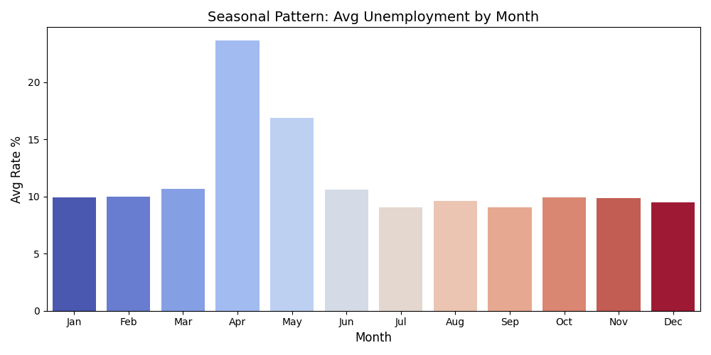
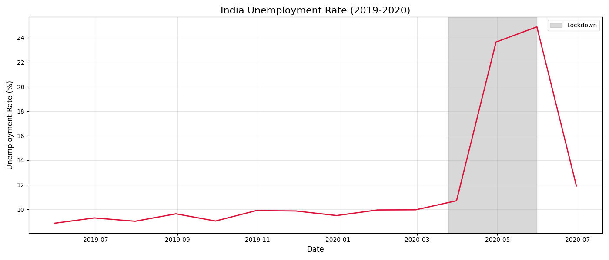
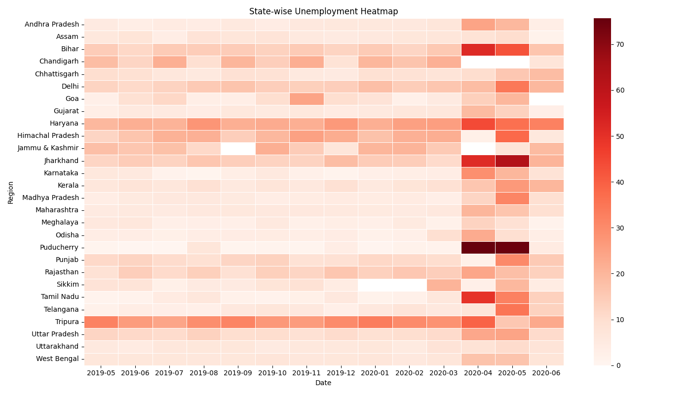

Analysis of Unemployment Trends in India (2019-2020)

Submitted to: Code Alpha
Submitted by: Mayank Shekhar Singhdeo
Date: 2nd July 2026

1. Introduction
This report analyzes unemployment data in India from May 2019 to June 2020. The objective is to identify seasonal trends, measure the impact of the Covid-19 lockdown, and compare regional variations across states.

2. Methodology
The `Unemployment in India.csv` dataset was analyzed using Python. Pandas was used for data cleaning and filtering. Matplotlib and Seaborn were used to create three visualizations: seasonal unemployment pattern, unemployment trend during Covid-19, and a state-wise heatmap.

3. Results and Analysis

Figure 1: Seasonal Pattern of Unemployment

Insight: Unemployment peaks in April-May and is lowest in October-November. This indicates a strong post-harvest seasonal dependency.
Policy Recommendation: The government should launch MGNREGA and other rural job programs preemptively in March-April. This will provide a safety net before the seasonal job crunch affects agricultural laborers.

Figure 2: Covid-19 Spike

Insight: The unemployment rate spiked sharply from around 8% to over 23% during the March-April 2020 lockdown.
Policy Recommendation: Direct cash transfers and emergency unemployment insurance should be pre-approved so they can be activated immediately during future national crises.

Figure 3: State-wise Unemployment Heatmap

Insight: The impact was not uniform. States like Odisha and Jharkhand were among the most severely affected in April-May 2020. Tripura shows a consistently high baseline unemployment rate even before Covid-19.
Policy Recommendation: Relief packages and skill development schemes should be targeted instead of being applied uniformly across India. States with high baseline unemployment, such as Tripura, need long-term employment support.

4. Conclusion and Policy Insights
The analysis confirms two key trends. First, unemployment in India is seasonal. Second, the Covid-19 lockdown caused a severe but uneven economic shock across states. These findings suggest that both seasonal employment support and targeted crisis-response policies are necessary for better labor market stability.
